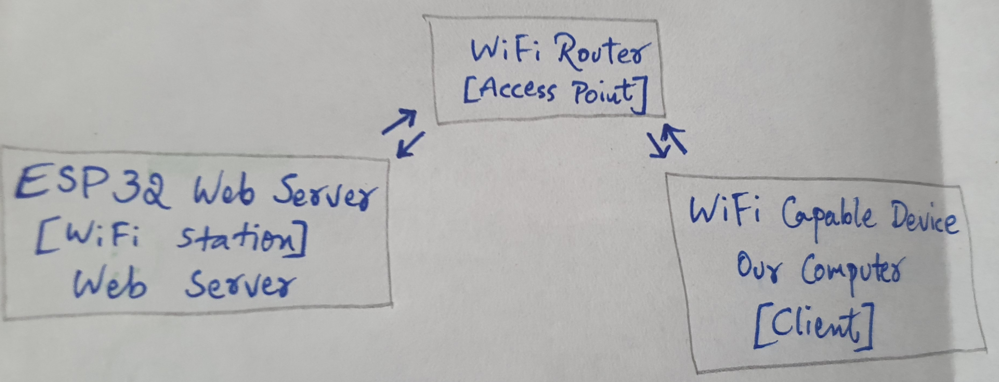
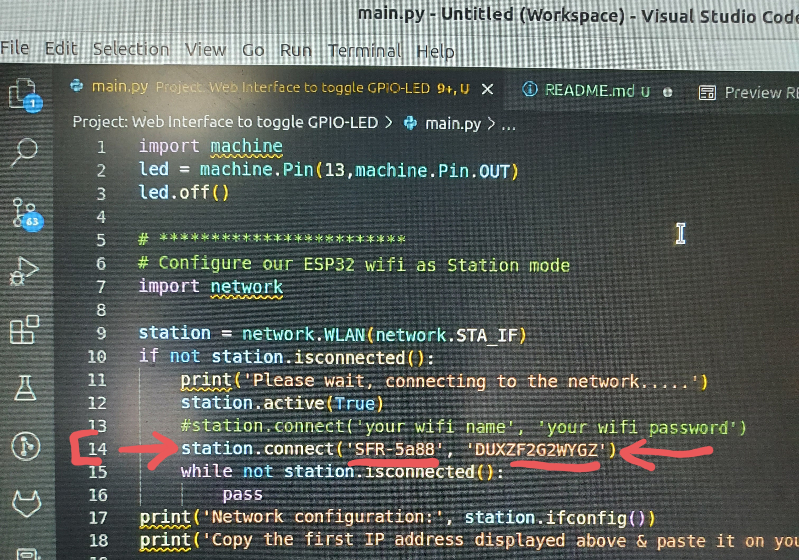
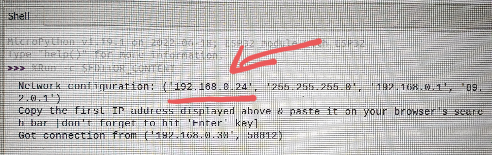
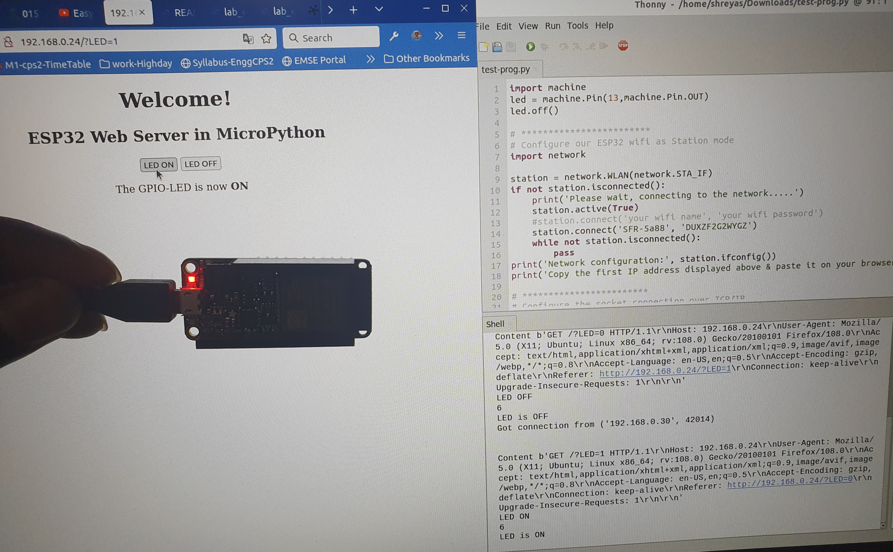
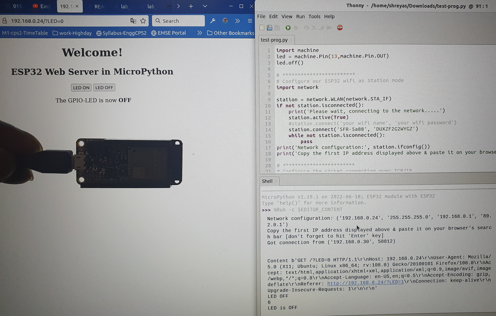

# Project: Web Interface to toggle GPIO-LED

We have created a web server which hosts the ESP32 for toggling the state of GPIO-LED pin using MicroPython.

>ESP32 can be configured either as a Station or Acess point or both at the same time. But in this project we have used ESP32 as Station mode only.

- We have configured the ESP32 Wi-Fi station 
- Connected it to a Wi-Fi router
- Wi-Fi router will serve as a middleman between the ESP32 web server and the client 
- client can be any device with Wi-Fi capability, in our case, our Computer is the client

## :gear: How to run this project

- connect your ESP32
- open `main.py` and edit the line number 14 to add your Wi-Fi cerendials [WiFi name & Password] on the `connect()` function's arguments
- save the `main.py` file
- upload the project to ESP32
- run the `main.py` [***Pymark:*** by importing `main.py` on the REPL terminal of ESP32]
- wait until a connection to your Wi-Fi is established
- once connected to your Wi-Fi, the `Network Configuration` is displayed
- copy the first IP address from the `Network Configuration's arguments`
- paste this copied IP adress in your browser's search bar & hit 'Enter' key
- Boom! You'll see the web interface on your browser
- click on the `LED ON` & `LED OFF` buttons to toggle the GPIO-LED's state of your ESP32
- the current state/status of GPIO-LED of your ESP32 is also displayed, just under the buttons

> check out ['Reference'](#reference) section for help! 

----------------------------

## Reference:

- Add your Wi-Fi cerendials [WiFi name & Password] here: 

- copy the first IP address from the `Network Configuration's arguments`: 

- GPIO-LED when turned 'ON': 

- GPIO-LED when turned 'OFF': 

------------------------------

## Content of the directory

- `main.py` contains the code for this project
- `.vscode/extensions.json` lists the extensions that are recommended for this project. VSC will prompt you to install these extensions if required.
- `.vscode/settings.json` lists folders to be scanned for Autocomplete and IntelliSense 
- `espTypeshed` typeshed for most modules available in the ESP32. There may be minor differences with the MicroPython version you actually have flashed on your ESP32, or some missing modules.
- `lib` put any existing module you may need here, you may use the filter [`micropython` on pypi](https://pypi.org/search/?q=micropython&o=) to find drivers or useful modules
- `boot.py` and `main.py` see https://docs.micropython.org/en/latest/esp8266/tutorial/filesystem.html#start-up-scripts
- `pymakr.conf` Pymakr configuration, lists for example which files shouldn't be uploaded to the device
- `README.md` this file. 