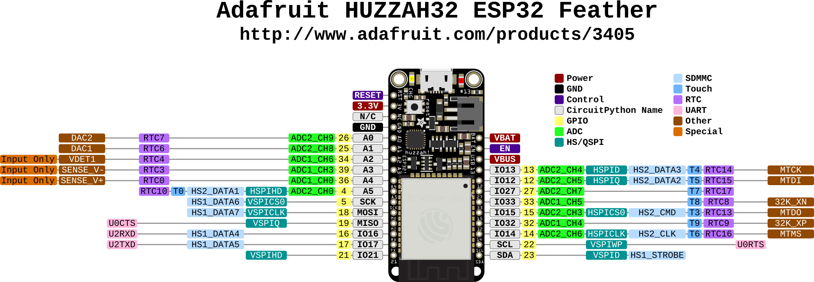
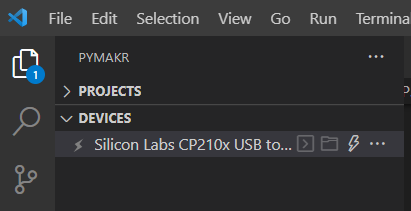
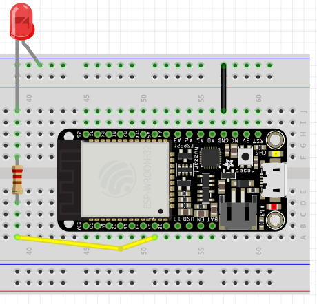
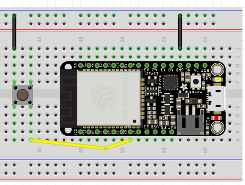
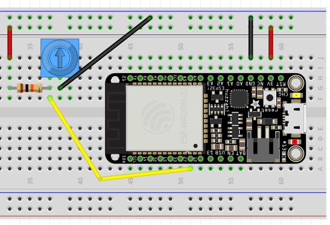
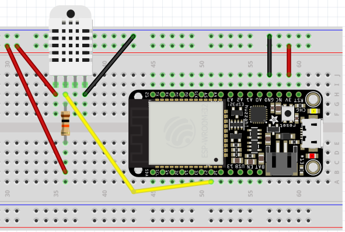
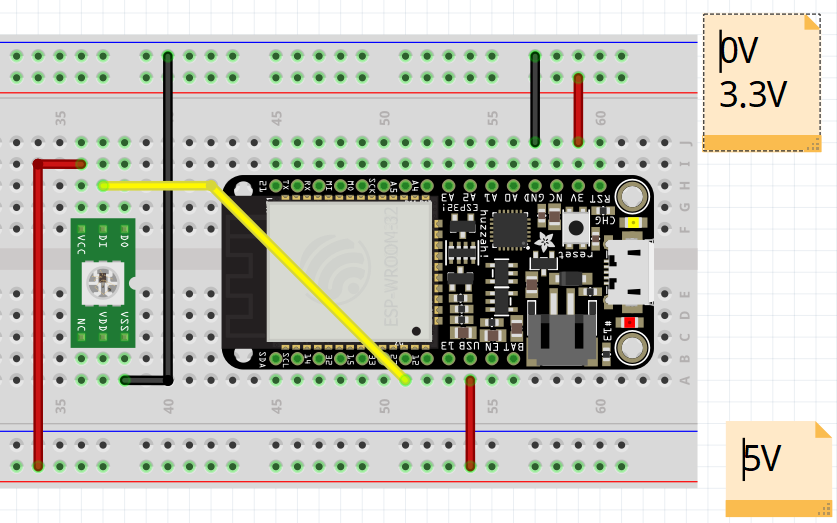

= First steps with programming the ESP32
Maxime Lefrançois maxime.lefrancois@emse.fr v1.0, 2022-11-16
:homepage: http://ci.mines-stetienne.fr/cps2/course/pcd/
:toc: left

In this lab you will learn to flash and program your ESP32 microcontroller with micropython.

== Introduction to the Adafruit HUZZAH32 - ESP32 Feather

ESP32 is a series of low-cost, low-power system on a chip microcontrollers with integrated Wi-Fi and dual-mode Bluetooth link:https://en.wikipedia.org/wiki/ESP32[(Wiki)].

The main microcontroller we use is a link:docs/adafruit-huzzah32-esp32-feather.pdf[FeatherBoard Adafruit HUZZAH32], that contains the link:docs/espressif-esp-wroom-32.pdf[Espressif ESP32-WROOM-32 module], a generic Wi-Fi + Bluetooth + Bluetooth Low Energy microcontroller unit. At its core, the ESP32-WROOM-32 module uses the link:docs/espressif-esp32.pdf[ESP32-D0WDQ6 chip].

.The Adafruit HUZZAH32 - ESP32 Feather pinouts

Browse the specifications about the ESP32-D0WDQ6, the ESP32-WROOM-32, and the FeatherBoard Adafruit HUZZAH32, and **answer the following questions:**

1. **What kind and how much of flash memory do each SoC provide?**
2. **What is the difference between pin A0 and pin A2?**
3. **Which ADC pins can't be used once the WiFi is initialized? Why? (WARNING: there are contradictory statements in the FeatherBoard Adafruit HUZZAH32 document, so double check online)**
4. **Which GPIO pins are input only?**
5. **On which SoC is the WiFi antenna? the Bluetooth antenna?**
6. **What are GPIO6 to GPIO11 used for?**
7. **On the FeatherBoard Adafruit HUZZAH32, there is a small chip with the inscription `SIL 2104 F0199 1705+`. What is that for?**
8. **Which GPIO pins are recommended for digital output? Digital input?**
9. **Why is GPIO#13 special?**
10. **How can the ESP32 hall sensor be used? (to do what, with reading what on what pin)**
11. **What UART is used for bootloading/debug?**
12. **What is a JST jack? What is it used for on the FeatherBoard Adafruit HUZZAH32?**
13. **What is the USB voltage?**
14. **What happens if we connect `GND` and `USB`? (DO NOT TRY)**
15. **What is the Serial0 interface used for?**
16. **What are 32 KHz crystals used for?**
17. **When the ADC is configured with `atten=3`, what integer would we read when measuring 1V?**

_(edit this file and write your answers here)_

1. Answer: FOR ALL ESP32 ROM IS 448 KB, and ADAFRUIT ROM IS 4 MB. 

2. Answer: A0 is a 12-bit ADC, and A2 is a 10-bit ADC.

3. Answer: Once the WiFi is enabled, ADC1 pins 6, 7, 8, 9, 10, and 11 are inoperable. because they are utilized in WiFi

4. Answer: GPIO 34, 35, 36, 37, 38, 39 are input only.

5. Answer: The WiFi antenna is on the ESP32-D0WDQ6 and the Bluetooth antenna is on the ESP32-WROOM-32

6. Answer: GPIO6 to GPIO11 are used for the flash memory

7. Answer: This is the chip that is used to store the wifi credentials.

8. Answer: GPIO 0,2,4,5,12,13,14,15,25,26,27,32,33 are recommended for digital output and GPIO 34-39 are recommended for digital input

9. Answer: GPIO#13 is special because it is used to flash the ESP32

10. Answer: The hall sensor is used to measure the magnetic field and it is read on GPIO 12

== Flash MicroPython on the ESP32

link:https://micropython.org/[MicroPython] is a full Python compiler and runtime that is optimized to run on microcontrollers. One can use an interactive prompt (the REPL) to execute commands immediately, or upload a set of python files to the microcontroller.

In this lab we will flash the micropython firmware on the ESP32, then use the Pymakr extension for link:https://code.visualstudio.com/Download[Visual Studio Code].

Follow the MicroPython tutorial link:https://docs.micropython.org/en/latest/esp32/tutorial/intro.html#esp32-intro[Getting started with MicroPython on the ESP32], and keep in mind the notes below.

NOTE: the "port" setting is `COM*` on Windows, `/dev/ttyS*` on Linux, `/dev/cu.*` on macOS (where * means "something"). Follow link:https://docs.espressif.com/projects/esp-idf/en/latest/esp32/get-started/establish-serial-connection.html#check-port-on-windows[this guide for Windows] or link:https://docs.espressif.com/projects/esp-idf/en/latest/esp32/get-started/establish-serial-connection.html#check-port-on-linux-and-macos[this guide for Linux and macOS] to find what port the FeatherBoard Adafruit HUZZAH32 is using.

NOTE: Windows users. If you don't see the COM port for your device, it may mean that the CP2104 USB to UART Bridge controller pilots are not installed. You can install link:https://www.silabs.com/developers/usb-to-uart-bridge-vcp-drivers[download them] and install them manually from the Device Manager.

NOTE: Windows users, you may use the Windows Subsystem for Linux version 1 (WSL1) to run commands. If your "port" setting is `COM5` on windows, then it becomes `/dev/ttyS5` on WSL1. Make sure your distribution uses WSL1 (not WSL2). If not, you can either convert an existing WSL2 distribution to WSL1, or install a fresh WSL1 distribution. Find tutorials online. 

WARNING: Linux users: must belong to groups `dialout` and `tty` to access the board.

== Open the interactive prompt (the REPL)

Once the MicroPython firmware is flashed on the device, you can install the Pymakr extension for link:https://code.visualstudio.com/Download[Visual Studio Code].

1. Make sure you have link:https://code.visualstudio.com/Download[Visual Studio Code] installed 
2. PyMakr require an installation of node.js on your machine. Make sure you can run command `node`.
3. Make sure you have the following extensions installed: link:https://marketplace.visualstudio.com/items?itemName=donjayamanne.python-extension-pack[Python Extension Pack], link:https://marketplace.visualstudio.com/items?itemName=ms-python.vscode-pylance[Pylance], link:https://marketplace.visualstudio.com/items?itemName=pycom.Pymakr[Pymakr].

In the Pymakr extension tab, you should find your device under `DEVICES`. Click on "Connect Device" (🗲 button), then on "Create a Terminal". 

That's it, you opened a REPL on the ESP32! Let's play a bit with it.

.Pymakr extension tab

== Turn on/off the LEDs

You need to check out the following guides for this exercise:

* link:https://docs.micropython.org/en/latest/esp8266/tutorial/repl.html#using-the-repl[Using the REPL]
* link:https://docs.micropython.org/en/latest/esp32/quickref.html#pins-and-gpio[MicroPython quick reference guide on Pins and GPIO].
* link:https://docs.micropython.org/en/latest/esp32/quickref.html#timers[MicroPython quick reference guide on Timers].

.Answer these questions and copy your code snippets below 
. Turn on and off the embedded LED on GPIO#13.
    

. Connect the LED you have in your briefcase to GPIO#27 as on the image below. Turn on and off this LED. 

.LED on GPIO#27

[start=3]
. Create a timer to turn on and off the LED on GPIO#13 every 500ms.

    
. Find a way to turn on and off the LED on GPIO#13 every 500ms, and the LED on GPIO#27 every 300ms.
    
    
. As the ESP32 has only four hardware timers (other microcontrollers usually have less), it wouldn't be possible to generalize the solution of exercise 4 to _n_ LEDs. Develop a solution that uses the link:https://docs.micropython.org/en/latest/library/uasyncio.html[`uasyncio` module for asynchronous I/O scheduling] 

NOTE: check how to link:https://docs.micropython.org/en/latest/esp8266/tutorial/repl.html#paste-mode[enter the special paste mode in the REPL] to copy and paste blocks of code 

_(edit this file and write your answers here)_

[source,python]
----
Turn on and off the embedded LED on GPIO#13.
    
        import machine
        pin = machine.Pin(13, machine.Pin.OUT)
        pin.on()
        pin.off()

Connect the LED you have in your briefcase to GPIO#27 as on the image below. Turn on and off this LED. 

        import machine
        pin = machine.Pin(27, machine.Pin.OUT)
        pin.on()
        pin.off()

Create a timer to turn on and off the LED on GPIO#13 every 500ms.

        import machine
        pin = machine.Pin(13, machine.Pin.OUT)
        def toggle(p):
            p.value(not p.value()) 
        import time
        while True: 
            toggle(pin)
            time.sleep_ms(500)

Find a way to turn on and off the LED on GPIO#13 every 500ms, and the LED on GPIO#27 every 300ms.

        import machine
        pin13 = machine.Pin(13, machine.Pin.OUT)
        pin27 = machine.Pin(27, machine.Pin.OUT)
        def toggle(p):
           p.value(not p.value()) 
        import time
        while True: 
            toggle(pin)
            time.sleep_ms(500)

Solution to Number 4 using the uasyncio module for asynchronous I/O scheduling

        import machine
        import uasyncio as asyncio

        async def blink(pin, delay):
        while True:
                pin.on()
                await asyncio.sleep_ms(delay)
                pin.off()
                await asyncio.sleep_ms(delay)

        async def main():
        pin1 = machine.Pin(13, machine.Pin.OUT)
        pin2 = machine.Pin(27, machine.Pin.OUT)
        await asyncio.gather(blink(pin1, 500), blink(pin2, 300))

        loop = asyncio.get_event_loop()
        loop.run_until_complete(main())
----

== Switch the LED when the button is pressed

You need to check out the following guides for this exercise:

* link:https://docs.micropython.org/en/latest/library/machine.Pin.html?highlight=irq#class-pin-control-i-o-pins[class Pin – control I/O pins], and especially link:https://docs.micropython.org/en/latest/library/machine.Pin.html?highlight=irq#machine.Pin.irq[the `Pin.irq()` method]

.Button on GPIO#27. When the button is pressed, the voltage on GPIO#27 is low. 

.Answer these questions and copy your code snippets below 
. Configure GPIO#27 as input with internal pull-up (so the default value is HIGH), and turn on and off the embedded LED on GPIO#13 whenever the button is pressed (on falling edge).

[source,python]
----
#Configure GPIO#27 as input with internal pull-up (so the default value is HIGH), and turn on and off the embedded LED on GPIO#13 whenever the button is pressed (on falling edge).

import machine
from machine import Pin

pin = machine.Pin(13, machine.Pin.OUT)
button = machine.Pin(27, machine.Pin.IN, machine.Pin.PULL_UP)

def toggle(p):
    p.value(not p.value())

def callback(p):
        toggle(pin)

button.irq(trigger=Pin.IRQ_FALLING, handler=callback)

----

== Print the value of the potentiometer

You need to check out the following guides for this exercise:

* link:https://docs.micropython.org/en/latest/esp32/quickref.html?highlight=adc#pwm-pulse-width-modulation[PWM (pulse width modulation)]
* link:https://docs.micropython.org/en/latest/esp32/quickref.html?highlight=adc#adc-analog-to-digital-conversion[ADC (analog to digital conversion)]

The circuit below is a simple voltage divider with a resistor of 10 kΩ and a potentiometer of 10 kΩ. 

.Potentiometer on GPIO#27. 

.Answer these questions and copy your code snippets below 
. Demonstrate the voltage measured on GPIO#27 should range between 0V and 1750mV
. Write a timer that reads the raw analog value every every 100 ms, and print the actual voltage to the UART0
. Use this value to control the pulse width modulation duty cycle on GPIO#13, so as to control the luminosity of the inner LED

[source,python]
----

Demonstrate the voltage measured on GPIO#27 should range between 0V and 1750mV

import machine
from machine import Pin
from machine import ADC
pin = machine.Pin(27, machine.Pin.IN)
adc = ADC(pin)
adc.read()

Write a timer that reads the raw analog value every every 100 ms, and print the actual voltage to the UART0
        
import machine
from machine import Pin
from machine import ADC
pin = machine.Pin(27, machine.Pin.IN)
while True:
    adc = ADC(pin)
    print(adc.read())
    time.sleep_ms(100)
----

== Hello Internet !

You need to check out the following guides, examples, and sources, for this exercise:

* link:https://docs.micropython.org/en/latest/library/time.html[`time` – time related functions]
* link:https://docs.micropython.org/en/latest/esp32/quickref.html#networking[Networking]
* link:https://github.com/micropython/micropython-lib/blob/master/micropython/net/ntptime/ntptime.py[sources of the `ntptime.py` MicroPython module]

.Answer these questions and copy your code snippets below 
. Print the current date and time of the ESP32
. Connect the ESP32 to your phone, configured as a WiFi Access Point.
. Print the IP address of your ESP32, and of your phone 
. Synchronize the internal clock with using the NTP protocol using the `ntptime` module
. Print the updated date and time, modified to take into account our timezone.

[source,python]
----

Print the current date and time of the ESP32

import time
print(time.localtime())

Connect the ESP32 to your phone, configured as a WiFi Access Point.

Print the IP address of your ESP32, and of your phone

import network
sta_if = network.WLAN(network.STA_IF)
sta_if.active(True)
sta_if.connect('SSID', 'password')
sta_if.ifconfig()

Synchronize the internal clock with using the NTP protocol using the `ntptime` module

import ntptime
ntptime.settime()

Print the updated date and time, modified to take into account our timezone.

import time
print(time.localtime())
----

== Deep-sleep and temperature reading

You need to check out the following guides for this exercise:

* link:https://docs.micropython.org/en/latest/esp32/quickref.html?highlight=deep%20sleep#deep-sleep-mode[Deep-sleep mode]
* link:https://docs.micropython.org/en/latest/library/esp32.html#module-esp32[`esp32` — functionality specific to the ESP32]

.Answer these questions and copy your code snippets below 
. Put the ESP32 to deep-sleep for 5 seconds. 
. On wake up, print the internal temperature in degrees Celsius
. Configure EXT0 to wake up the device from sleep if a Pin of your choice is low. 
. set up a circuit such that you can put the ESP32 in deep sleep, and wake it up when pressing a button.
. Put the ESP32 to deep-sleep for 5 seconds. 
. On wake up, print the cause (button or timeout), and the internal temperature in degrees Celsius

[source,python]
----
python code here

#Put the ESP32 to deep-sleep for 5 seconds.
from machine import deepsleep
deepsleep(5000)

#On wake up, print the internal temperature in degrees Celsius
from machine import deepsleep
from esp32 import raw_temperature
deepsleep(5000)
temp = raw_temperature() / 100
print("Temperature: {}".format(temp))

#Configure EXT0 to wake up the device from sleep if a Pin of your choice is low.

from machine import deepsleep, Pin
wakeup_pin = Pin(0, Pin.IN)
wakeup_pin.irq(trigger=Pin.IRQ_FALLING, handler=lambda pin: None)
deepsleep()

#set up a circuit such that you can put the ESP32 in deep sleep, and wake it up when pressing a button.

from machine import deepsleep, Pin
wakeup_pin = Pin(0, Pin.IN)
wakeup_pin.irq(trigger=Pin.IRQ_RISING, handler=lambda pin: None)
button_pin = Pin(12, Pin.IN, Pin.PULL_UP)
while True:
  if not button_pin.value():
    deepsleep()

#Put the ESP32 to deep-sleep for 5 seconds.
from machine import deepsleep
deepsleep(5000)

#On wake up, print the cause (button or timeout), and the internal temperature in degrees Celsius

from machine import deepsleep, Pin

wakeup_pin = Pin(0, Pin.IN)
wakeup_pin.irq(trigger=Pin.IRQ_FALLING, handler=lambda pin: None)

button_pin = Pin(12, Pin.IN, Pin.PULL_UP)
while True:
  if not button_pin.value():
    deepsleep()

from esp32 import raw_temperature
temp = raw_temperature() / 100
print("Temperature: {}".format(temp))

----
       

== DHT22 temperature sensor

Every briefcase should contain a link:docs/DHT22.pdf[DHT22 temperature and humidity sensor]. 
You need to check out the following guides for this exercise:

* link:https://docs.micropython.org/en/latest/esp32/quickref.html?highlight=dht22#dht-driver[DHT driver]
* link:https://github.com/micropython/micropython-lib/blob/master/micropython/drivers/sensor/dht/dht.py[sources of the `dht.py` MicroPython module]
* link:https://github.com/micropython/micropython/tree/master/drivers/dht[sources of the `dht.c` MicroPython driver]

.Answer these questions and copy your code snippets below 
. Make the setting below and read the temperature and the humidity
. Use excerpts of the code from `dht.py` to fetch an actual data frame (40 bits) from the DHT22 sensor, and display the 16 bits of the temperature and the corresponding integer value, the 16 bits of the humidity and the corresponding integer value, and the 8 bits of the checksum.
. Compare the datasheet and the the dht MicroPython and C driver sourcecode: 
.. compare the phases in the communication, and the timing. Write your observations below.
.. at which lines the individual bits are appended to form an array of bits?
.. at which lines is the temperature computed from the first 16 bits?
.. at which lines is the humidity computed from the next 16 bits?
.. at which lines is the checksum computed and compared to the last 8 bits?

.DHT22 on GPIO#27

[source,python]
----
python code here
----

== WS2812B Breakout RGB led

Every briefcase should contain a link:docs/WS2812B_Breakout.pdf[BOB-13282 SparkFun Breakout board], which solely contains a link:docs/WS2812B.pdf[WS2812B] RGB led and a 0.1 uF capacitor. You need to check out the following guides for this exercise:

* link:https://docs.micropython.org/en/latest/esp32/quickref.html?highlight=dht22#neopixel-and-apa106-driver[NeoPixel driver]
* link:https://github.com/micropython/micropython-lib/blob/master/micropython/drivers/led/neopixel/neopixel.py[sources of the `neopixel.py` MicroPython module]

.Answer these questions and copy your code snippets below 
. What is such a capacitor used for?
. Light up the LED, test different colors and intensities
. Compare the datasheet and the the neopixel MicroPython driver sourcecode: 
.. Do we need to send data at 800Kbps or 400Kbps?
.. How long would it take to change the color of a strip of 100 WS2812B?
.. Where is it justified in the datasheet that the input voltage can be 3.3V (3.5V actually) even though the WS2812B is powered at 5V?
.. What are T0H, T1H, T0L, T1L, used for? 
. find the `bitstream` method sourcecode in C (ESP32-specific source file). Check how it is linked to the link:https://docs.micropython.org/en/latest/library/esp32.html#rmt[RMT (Remote Control) module, specific to the ESP32].

.WS2812B on GPIO#27

NOTE: the actual pinout of the BOB-13282 SparkFun Breakout board is different: VCC=5V VSS=GND DI=DI

[source,python]
----
python code here
----

== The 32x128 OLED Screen

Every briefcase should contain a link:https://learn.adafruit.com/adafruit-oled-featherwing/[Adafruit FeatherWing 128x32 OLED display], which contains a link:docs/UG-2832HSWEG02.pdf[128x32 SSD1306 OLED] controllable using the common link:SSD1306.pdf[SSD1306 I2C Driver], and three buttons A, B, C. You need to check out the following guides for this exercise:

* link:https://docs.micropython.org/en/latest/esp8266/tutorial/ssd1306.html?highlight=ssd1306[Using a SSD1306 OLED display]
* link:https://docs.micropython.org/en/latest/library/framebuf.html?highlight=framebuf#module-framebuf[`framebuf` — frame buffer manipulation]
* link:https://github.com/micropython/micropython-lib/blob/master/micropython/drivers/display/ssd1306/ssd1306.py[sources of the `ssd1306.py` MicroPython module]

.Answer these questions and copy your code snippets below 
. What does I2C stands for?
. To what pins are buttons A, B, C, connected?
. What is the default I2C address for the I2C peripheral? Check from the link:SSD1306.pdf[official documentation] section 8.1.5 a), with "SA0"=0. and "R/W#"=0
. Print the current date and time on the screen, update every second.
. When button A is pressed, invert the colours. 
. Also print a counter that increments when button B is pressed (use an interrupt)
. The source of the `framebuf.FrameBuffer` class that `SSD1306` inherits from, and its methods, is actually defined in a C file in the link:https://github.com/micropython/micropython/tree/master/extmod[`extmod` folder] of the MicroPython repository (see link:https://docs.micropython.org/en/latest/develop/gettingstarted.html?highlight=extmod#folder-structure[description here]). 
.. Find the file + line where the constructor is defined
.. Find the file + line where the `text` method is defined
. In this file, we see that the `framebuf.FrameBuffer.text()` method uses the `font_petme128_8x8` object at line 794, which stores the pixel array for each ascii character and is defined in a library that is included at line 35.
.. Describe how each character is defined as bits and bytes.
.. Choose a little monster in the image below, and write what would be the 8 bytes to display this monster.
. Using your answer to question 8b, print one of the monsters below on the screen.

.Little 8x8 monsters

[source,python]
----
python code here

#What does I2C stands for?

----

== Next steps

Next your will develop a small integrated project in the IDE, and upload your code to your ESP32. Move to `lab_esp32_micropython_project.adoc`

