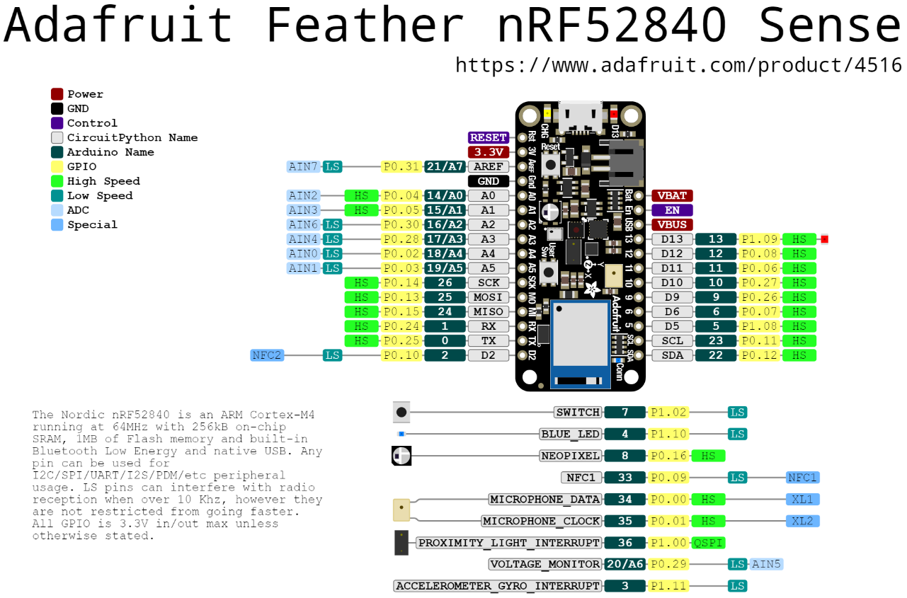

= First steps with programming the Adafruit Feather nRF52840 Sense
Maxime Lefrançois maxime.lefrancois@emse.fr v1.0, 2022-11-16
:homepage: http://ci.mines-stetienne.fr/cps2/course/pcd/
:toc: left

In this lab you will set up your working environment in Visual Studio Code for developing a CircuitPython project for your two nRF52840 microcontrollers, and develop a small integrated project of your choice.

== Introduction to the Adafruit Feather Bluefruit Sense

The nRF52 Series SoCs was the second series of short range wireless SoCs from Nordic Semiconductor. The nRF52840 SoC is very successful and exists in millions of popular consumer devices in the world today, among them wireless mice, keyboards and audio devices. The popularity of Nordic's nRF52 series allows for Nordic Semiconductor to maintain a 40% worldwide market share in the Bluetooth LE segment. (source: Wikipedia)

The briefcase contains two link:docs/adafruit-feather-sense.pdf[Adafruit Feather Bluefruit Sense], that contain the link:docs/nRF52840_PS_v1.7.pdf[nRF52840] Soc, which is well known for its Bluetooth 5 + IEEE 802.15.4-2006, 2.4 GHz transceiver.

The Adafruit Feather Bluefruit Sense also embeds a set of environmental and motion sensors:

* ST Micro series 9-DoF motion - link:docs/LSM6DS33.pdf[LSM6DS33 Accel/Gyro] + link:docs/lis3mdl.pdf[LIS3MDL magnetometer]
* link:docs/Avago-APDS-9960-datasheet.pdf[APDS9960 Proximity, Light, Color, and Gesture Sensor]
* link:docs/MP34DT01-M.pdf[MP34DT01-M] PDM Microphone sound sensor
* link:docs/Sensirion_Humidity_Sensors_SHT3x_Datasheet_digital-971521.pdf[SHT Humidity sensor]
* link:docs/BST-BMP280-DS001-11.pdf[BMP280 temperature and barometric pressure/altitude sensor]

.The Adafruit Feather Bluefruit Sense pinouts

Browse the specifications about these products.  Answer the following questions.

1. **What kind and how much of flash is available for programs?**
2. **For each sensor, state what is its digital interface to the main nRF52840 SoC.**
3. **For I2C connected devices, provide examples of data flow for obtaining measurement values.** 
4. **How is the microphone data transmitted?**
5. **Why are the proximity light and the accelerometer/gyro connected have interrupt pins on gpio#36 and gpio#3? What can that be used for? How?**
6. **What kind of process would be necessary to detect that the sound is louder than a threshold value?**

_(1. In terms of flash memory, the nRF52840 Soc includes 1 MB of flash and 256 KB of RAM.)_

_(2. The sensors are connected to the nRF52840 SoC through I2C, SPI, or UART.)_

_(3. The data flow for obtaining measurement values from the SHT Humidity sensor is as follows:
1. The master sends a start condition.
2. The master sends the slave address and the R/W bit.
3. The slave sends an acknowledge.
4. The master sends the command to read the temperature.
5. The slave sends an acknowledge.
6. The master sends a stop condition.
7. The master sends a start condition.
8. The master sends the slave address and the R/W bit.
9. The slave sends an acknowledge.
10. The master reads the temperature data.
11. The master sends a stop condition. )_

== Start working with CircuitPython on the nRF52840

Follow these steps:

1. Install the CircuitPython extension for Visual Studio Code
2. follow the steps at https://learn.adafruit.com/adafruit-feather-sense/circuitpython-on-feather-sense 
3. open the usb directory inside visual studio code
4. in the `View - Command Palette` menu, select the board using command `> CircuitPython: choose CircuitPython Board` and select `Adafruit Industries LLC: Feather Bluefruit Sense`
5. one by one, install the libraries you need using the command `> CircuitPython: Show available libraries`, then search for a library, then press enter. the libraries should be downloaded in the lib folder.

NOTE: the sources of these libraries can be found link:https://github.com/adafruit/Adafruit_CircuitPython_Bundle/tree/main/libraries/drivers[on github]. In the repository of each library, for example for the link:https://github.com/adafruit/Adafruit_CircuitPython_APDS9960[APDS9960 Proximity, Light, RGB, and Gesture Sensor], you will find the source code, the sources of the documentation, and ready-to-run examples.

NOTE: The documentation is published at `https://docs.circuitpython.org/projects/<<name_of_the_library>>/en/latest/api.html`. For example: 

* https://docs.circuitpython.org/projects/apds9960/en/latest/api.html for the APDS9960 Proximity, Light, RGB, and Gesture Sensor
* https://docs.circuitpython.org/projects/bmp280/en/latest/api.html for the BMP280 Temperature and Barometric Pressure sensor

Answer the following questions.

1. **List some of the main differences you notice in the core modules of MicroPython and CircuitPython**
2. **If one wants to backport a CircuitPython to MicroPython, what kind of modifications could be necessary?**

_(edit this file and write your answers here)_

== Small integrated project

In the remaining time allocated by the professor, develop one or more small projects that integrate the different sensors and actuators of the Adafruit Feather Bluefruit Sense, and potentially some of the different peripherals you have used in lab `lab_esp32_micropython_intro.adoc`.

Write here the location of the project in your repository, and describe the main purpose and functionnalities of your project in its `README.md` file.

IMPORTANT: You may totally use snippets from existing samples or answers to questions on stackoverflow for example. But whenever you do **cite your sources** 

== Next steps

Next your will work a bit with BLE. Move to `lab_ble.adoc`