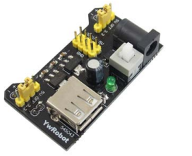
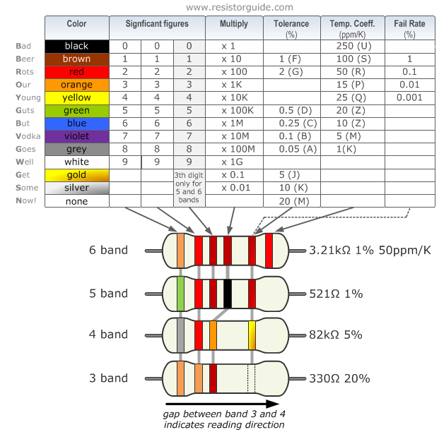
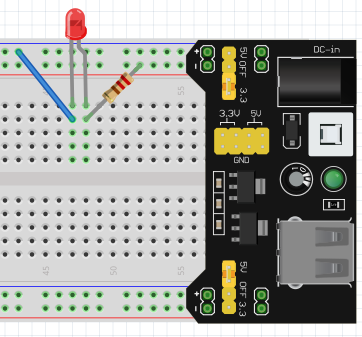

= Testing the simple electronic components
Maxime Lefrançois maxime.lefrancois@emse.fr v1.0, 2022-11-15
:homepage: http://ci.mines-stetienne.fr/cps2/course/pcd/
:toc: left

This lab links to datasheets and user guides for some of the hardware in your lab briefcase. These datasheets and guides can be found in the `docs` folder.

== Breadboard

Most of the hardware contained in your briefcase can be plugged on a prototyping board. Ours is manufactured by BPS and is of type link:docs/Breadboard-BB830.pdf[BB830].

IMPORTANT: link:https://learn.adafruit.com/breadboards-for-beginners/breadboards[Learn how to use the breadboard]

== MB102 Breadboard 3.3V/5V Power Supply

You can supply 3.3V and/or 5V power to the breadboard using the MB102 power supply.

IMPORTANT: link:docs/MB102-Datasheet.pdf[check out the datasheet]

Check that the LED on the MB102 turns on if you power it, and that both jumpers are set in the 3.3 V position.

== Resistors

Every briefcase should contain a high value (ex: 470 kΩ) , a medium value (10 kΩ) and a small value (ex: 100 Ω or 220 Ω) resistor. Check the chart below to know the values of your resistors. 

NOTE: If you don't have a resistor for one of the cateories (high, medium, low), then ask the professor.

**What resistor values do you have ?**

_(474kΩ 5% and 224kΩ 5%)_

== LED

Every briefcase should contain a LED. The color may differ. Check that you can turn it on. Use a small resistor to limit the current, which will keep the LED from burning out.

**Assuming that you power the circuit at 3.3 V and the led has a 2 V nominal forward voltage drop, and you use a resistor of 220 Ω:**

1. **calculate the voltage across the resistor**
2. **calculate the current flowing through the circuit using the formula U = R x I**

_(1.  V = 3.3 - 2 = 1.3 V )_

_(2.  I = 1.3 / 220 = 0.0059 A)_

== Buttons

The briefcase should contain two Omron tactile buttons from link:docs/omron-b3f.pdf[the B3F series]

Check that both buttons work with the setting below.

image::images/button.png[]

**Check the datasheet and answer the questions below:**

1. **What model is the grey button? the pink button?**
2. **What operating force do they have?**

_(1. The grey button is the B3F-1000P and the pink button is the B3F-1000P-1A)_

_(2. The operating force of the grey button is 0.5 N and the operating force of the pink button is 0.2 N)_

== Potentiometer

The briefcase should contain a blue link:docs/adafruit-356.pdf[Adafruit 356 10 kΩ potentiometer] with three pins: P1, P2, P3.
The resistor value between P1 and P3 is always 10 kΩ. The resistor value between P1 and P2 varies when you turn the knob. the resistor between P1 and P2 plus the resitor between P2 and P3 equals 10 kΩ.

Check that the potentiometer works with the setting below, which should allow you to dim the LED.

== Next steps

Next we will flash and program the ESP32. Move on to `lab_esp32_micropython.adoc`
